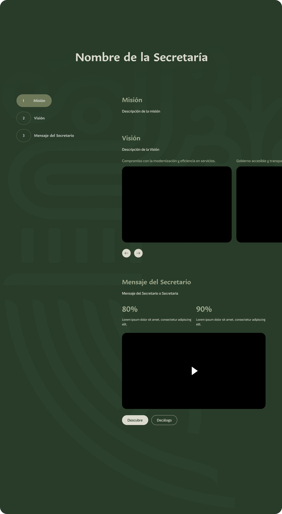

# Componente Acerca De

# Descripción 

El componente de “Acerca de” es la sección superior de la página. Es el inicio de la página “Acerca De” y debe proporcionar información clara, reflejando nuestro compromiso con la ciudadanía.

### Este componente es importante que incluya:

### 1. Misión y visión:
- Declaración oficial de la misión y visión de la dependencia.

### 2. Mensaje institucional o del titular (de preferencia en video):
- Un mensaje breve dirigido a la ciudadanía, emitido por el titular de la dependencia, en el que destaque el compromiso con el servicio público y los valores institucionales.
- **Nota:** Anexar video.

### 3. Breves imágenes:
- **Dimensiones requeridas:** 800 x 800 px.
- **Finalidad:** Imágenes concisas que transmitan lo que es la Secretaría y el proposito de la misma, deben cumplir con los estándares visuales de su dependencia.

- **Boton "Conoce mas"** Este boton tiene como uso, redirijir a la pagina que la secretaria desee importante.
- **Boton "Decalogo"** Este boton tiene como uso, redirijir a la pagina de "Decalogo" del Gobierno del Estado.

