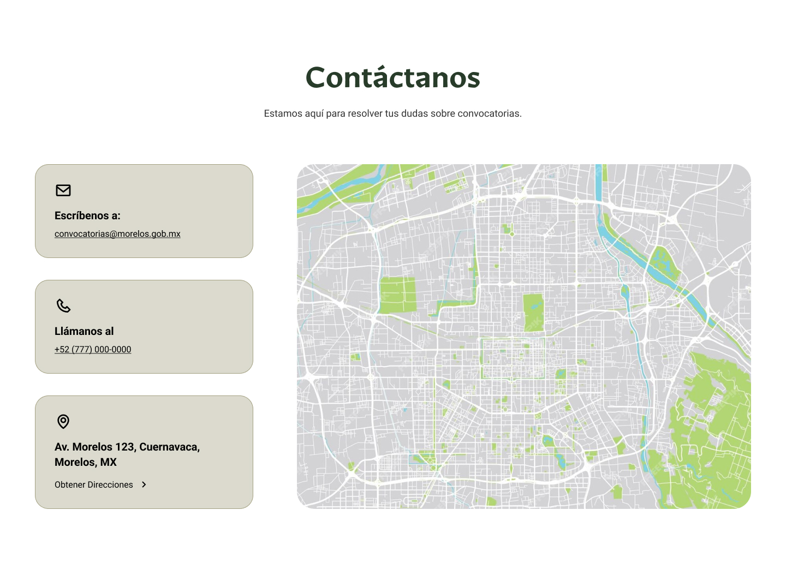

# Componente Contactanos

### Descripción 

El componente de contáctanos está diseñado dinámicamente para permitir a los usuarios comunicarse fácilmente con las dependencias. 

### Este componente debe estar compuesto por:

### Información de Contacto de la Dependencia

### 1. Ubicación de la Dependencia

- Dirección completa, incluyendo código postal.
- Enlace a Google Maps (si está disponible).

---

### 2. Teléfonos de Contacto

- Número principal y extensiones (si aplica).
- Línea de WhatsApp (en caso de contar con ella).

---

### 3. Correos Electrónicos Oficiales

- Correo general para atención a la ciudadanía.
- Correos específicos para áreas clave (si corresponde).

---

### 4. Horario de Atención

- Días y horarios en los que la dependencia está disponible para atender al público.

---

### 5. Otros Canales de Atención (Opcional)

- Redes sociales oficiales.

### Vista del Componente
