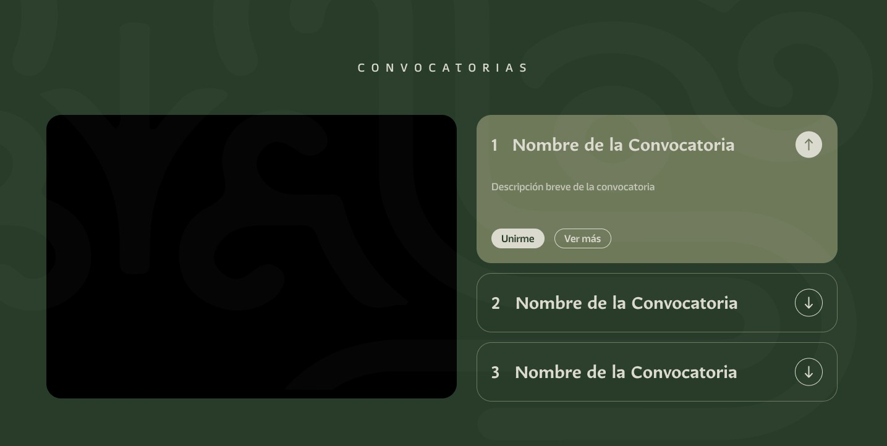

# Componente de Convocatorias

# Descripción 

El componente de convocatorias es una sección diseñada para mostrar información sobre eventos, concursos, oportunidades laborales, becas o actividades organizadas por la institución. Este componente debe incluir detalles como:

1. **Imagen de portada de la convocatoria:**
   - **Dimensiones requeridas:** 800 x 800 px.
   - **Finalidad:** Esta será la imagen principal de la convocatoria en la página principal del sitio web.
   - **Nota:** Asegúrese de que la imagen sea representativa del tema de la convocatoria y cumpla con los estándares visuales de su dependencia.

2. **Contenido de la tarjeta (Card):**
   - **Título:** Indique el título oficial de la convocatoria.
   - **Breve descripción:** Proporcione un resumen conciso que explique el propósito principal de la convocatoria (máximo 2-3 líneas).

3. **Textos descriptivos:**
   - Proporcione una descripción detallada sobre la convocatoria, explicando en qué consiste, a quién está dirigida y los objetivos principales.

4. **Archivo PDF (si aplica):**
   - Si hay información adicional o documentos relacionados con la convocatoria, adjunte el archivo en formato PDF para que pueda ser descargado desde el sitio web.
   - En caso de contar con una imagen ilustrativa para este archivo, por favor adjúntela.

