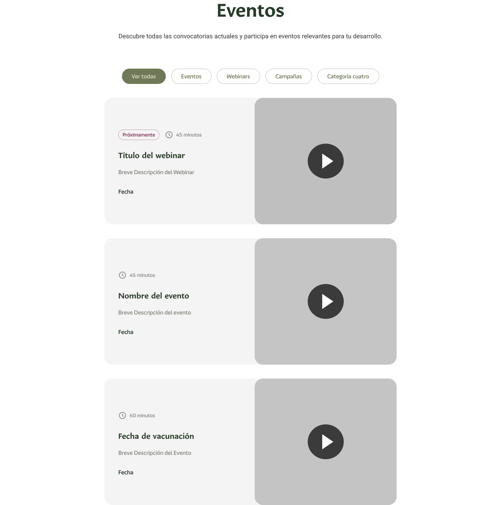

# Componente Eventos

### Descripción 

El componente de eventos es una sección interactiva diseñada para mostrar información relevante sobre eventos próximos, pasados o en curso. 

### Este componente debe estar compuesto por:

### Título del Evento

Un nombre claro y atractivo que resuma de qué trata el evento.

**Ejemplo:**
> Webinar: Actualización en Trámites del Registro Civil

---

### Breve Descripción

Un texto breve (2-3 líneas) que explique el propósito del evento, su valor y a quién está dirigido.

**Ejemplo:**
> Descubre las nuevas herramientas digitales para agilizar tus trámites. Este webinar es ideal para usuarios y colaboradores del Gobierno del Estado.

---

### Imagen, Video o Foto

Incluye un elemento visual relevante al evento:
- Foto del lugar del evento (si es presencial).
- Imagen promocional de la campaña o webinar.
- Video teaser o breve introducción del tema.

---

### Enlace o Fechas Relevantes

Dependiendo del tipo de evento, asegúrate de incluir:

### Para Webinars:
- **URL de la sesión virtual.**
- **Fecha y hora del webinar.**

**Ejemplo:**
> - URL: [Accede al Webinar](#)
> - Fecha: Miércoles 25 de diciembre de 2024.
> - Hora: 11:00 AM.

### Para Eventos Presenciales:
- **Dirección del lugar** (puede ser un enlace a Google Maps).
- **Fecha y hora del evento.**

**Ejemplo:**
> - Lugar: Salón Morelos, Registro Civil Estatal.
> - Fecha: 18 de diciembre de 2024.
> - Hora: 10:00 AM.

### Para Campañas:
- **URL o formulario de inscripción** (si aplica).
- **Periodo de duración de la campaña.**

**Ejemplo:**
> - URL: [Más información sobre la campaña](#)
> - Vigencia: Del 1 al 31 de enero de 2024.

### Vista del Componente
