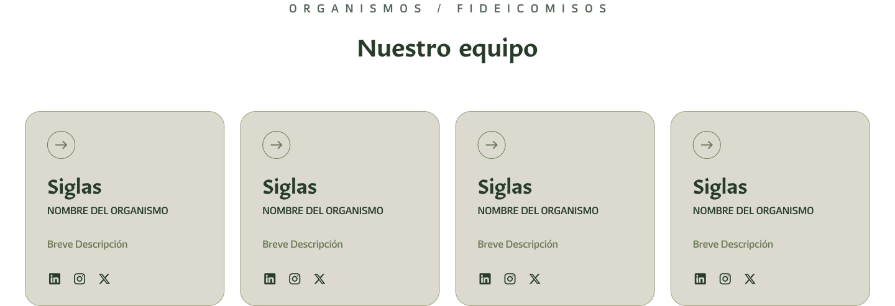

# Componente Fideicomisos/Organismos

### Descripción 

Este componente tiene como objetivo mostrar y redirigir a los fideicomisos/organismos que están ligados o dependan de la secretaría (en caso de contar con alguno).Debe contener:

### Información de las dependencias correspondientes (en caso de contar con alguna):
- **Logo institucional:** De cada dependencia asociada, en alta resolución.
- **Nombre oficial:** De la dependencia.
- **Breve descripción:** De 2 a 3 líneas sobre sus funciones o áreas de competencia.
- **Redes sociales:** De los fideicomisos/organismos.

