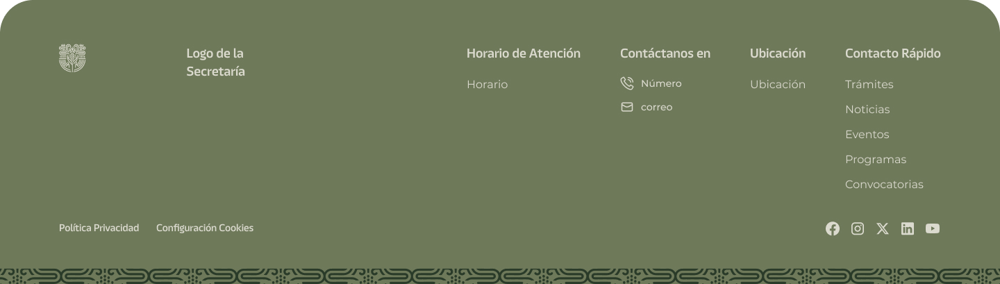

# Componente Footer Universal

### Descripción 

El componente de footer es la sección inferior de la página web. Es importante que proporcione información adicional y enlaces relevantes para los usuarios, ya que va a estar homologada y universal para su uso en todas las paginas web.

### Este componente incluye:

1. **Horario de atención:**
   - Indique el horario oficial de atención al público (días y horas).

2. **Número(s) de teléfono:**
   - Proporcione los números de contacto para atención al público o soporte relacionado con los servicios de la dependencia.

3. **Correo electrónico de contacto:**
   - Incluya un correo oficial al que los ciudadanos puedan dirigir sus consultas o solicitudes.

4. **Ubicación física:**
   - Especifique la dirección oficial de la dependencia, incluyendo detalles como colonia, municipio, estado y código postal.

5. **Redes Sociales:**
   - En caso de que la dependencia cuente con redes sociales, se deberan incluir.

6. **Aviso de privacidad:**
   - En caso de que la dependencia recabe datos personales a través del sitio web, es importante desarrollar un aviso de privacidad que cumpla con las normativas vigentes en materia de protección de datos.
   - De ser posible, proporcione el texto oficial del aviso o colabore con el área jurídica correspondiente para redactarlo.

