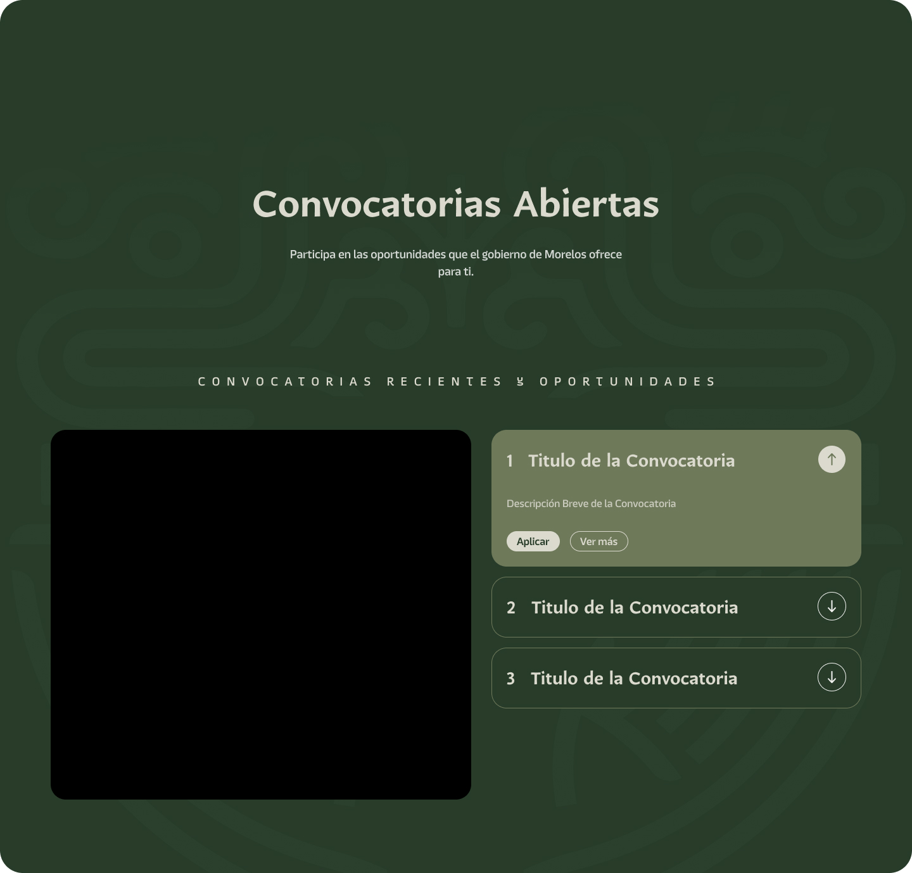

# Componente Header Convocatoria

### Descripción 

El componente de Convocatoria está diseñado para difundir oportunidades dirigidas a la ciudadanía, organizaciones y grupos interesados en participar en proyectos, programas o iniciativas de la dependencia.

### Este componente debe estar compuesto por:

### Convocatorias

### Imagen de Portada de la Convocatoria
- **Dimensiones requeridas:** 800 x 800 px.
- **Finalidad:** Esta será la imagen principal de la convocatoria en la página principal del sitio web.
- **Nota:** Asegúrese de que la imagen sea representativa del tema de la convocatoria y cumpla con los estándares visuales de su dependencia.

### Contenido de la Tarjeta (Card)
- **Título:** Indique el título oficial de la convocatoria.
- **Breve descripción:** Proporcione un resumen conciso que explique el propósito principal de la convocatoria (máximo 2-3 líneas).

### Textos Descriptivos
- Proporcione una descripción detallada sobre la convocatoria, explicando en qué consiste, a quién está dirigida y los objetivos principales.

### Archivo PDF (si aplica)
- Si hay información adicional o documentos relacionados con la convocatoria, adjunte el archivo en formato PDF para que pueda ser descargado desde el sitio web.
- En caso de contar con una imagen ilustrativa para este archivo, por favor adjúntela.

### Vista del Componente
