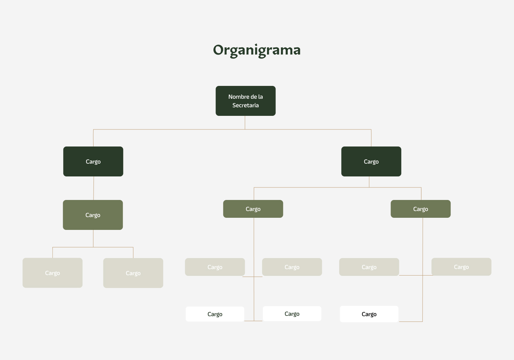

# Componente de Organigrama ###

### Descripción 

Este componente tiene como objetivo mostrar la organización actualizada de la secretaría.
Debe contener:

### Organigrama oficial:
- El organigrama actualizado de la dependencia en formato editable (preferentemente PDF, Word o imagen).

### Vista del Componente
