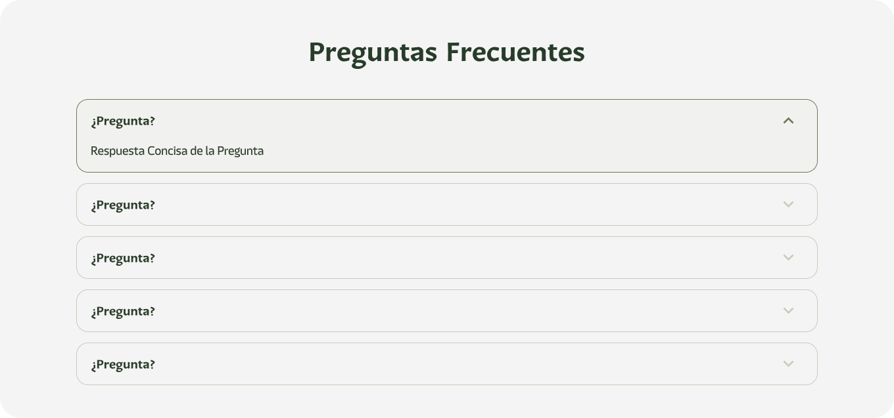

# Preguntas Frecuentes (Universal)

### Descripción 

El componente de preguntas y respuestas está diseñado dinámicamente para responder de manera eficiente las dudas más comunes de los usuarios, proporcionando acceso rápido a información específica sobre los “Programas Sociales, programas permanentes, trámites y servicios, dependencias, entre otros.”

### Este componente debe estar compuesto por:
### Preguntas Frecuentes (FAQ)

Un mínimo de cinco preguntas con respuestas claras y útiles.

>**Ejemplo:**
>1. **¿Quiénes pueden participar en este programa?**
   Personas que cumplan con los requisitos de ingreso y residencia.

>2. **¿Qué documentos necesito para registrarme?**
   CURP, identificación oficial y comprobante de domicilio.

>3. **¿Dónde puedo inscribirme?**
   En la oficina del Registro Civil más cercana.

>4. **¿Cuánto tiempo tarda el trámite?**
   Se entrega el mismo día.

>5. **¿Puedo solicitar el trámite desde otro estado?**
   Sí, a través del portal en línea

### Vista del Componente
