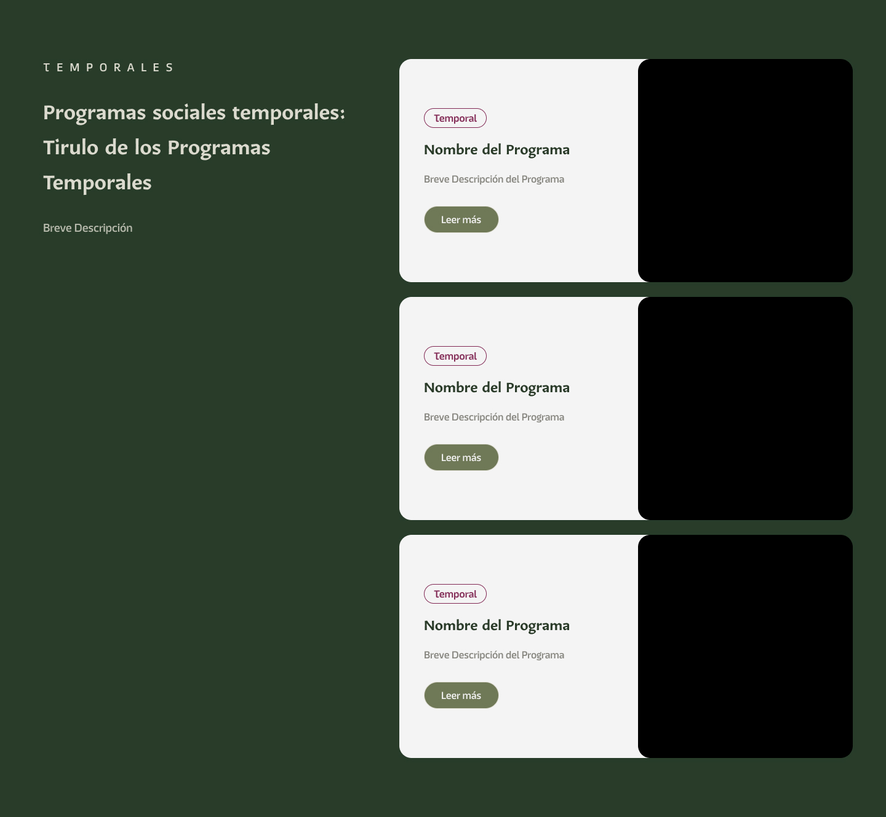

# Programas Sociales (Temporales)

### Descripción 

Este componente está destinado a destacar programas sociales de la dependencia que se encuentran disponibles de manera temporal, ofreciendo atención continua y constante a la población. 

### Este componente debe estar compuesto por:
### Título del Programa

Un título claro y breve que resuma el nombre del programa, asegurando que sea fácil de identificar.

>**Ejemplo:** "Apoyo Alimentario para Familias Vulnerables"

---

#### Breve Descripción del Programa

Un párrafo introductorio (2-3 líneas) que explique de forma resumida en qué consiste el programa y a quién está dirigido.

>**Ejemplo:** Este programa busca garantizar la seguridad alimentaria de familias en situación de vulnerabilidad mediante la entrega de despensas mensuales con productos básicos.

---

### Imagen Relacionada

Una imagen que represente el programa de manera visual. Esto puede ser una fotografía de beneficiarios, productos entregados, o un gráfico representativo.

---

### Descripción Detallada

Un texto más profundo que explique la esencia del programa, dividido en estas secciones:

### Cómo
Descripción del proceso para acceder al programa o cómo funciona.

> **Ejemplo:** Inscríbete en tu oficina local del Registro Civil presentando tu CURP y comprobante de domicilio.

### Cuándo
Fechas importantes, como el periodo de inscripción o entrega de beneficios.

> **Ejemplo:** El registro estará abierto del 1 al 31 de enero de 2024.

### Dónde
Lugares donde se puede acceder al programa o dónde se realizan las actividades.

> **Ejemplo:** Disponible en todas las oficinas del Registro Civil del estado.

### Quiénes
Público objetivo o requisitos para ser beneficiario.

> **Ejemplo:** Dirigido a familias con ingresos menores a 3 salarios mínimos.

### Por qué
Razón de ser del programa y su impacto en la comunidad.

> **Ejemplo:** Garantizar el derecho básico a la alimentación y mejorar la calidad de vida.

---

### Beneficios Clave del Programa

Una lista concisa con los beneficios principales para el público objetivo.

> **Ejemplo:** 
> - Acceso a despensas mensuales gratuitas. 
> - Reducción de gastos en alimentos básicos.  
> - Apoyo prioritario a familias numerosas y personas mayores.

- **Boton "Leer Más":** Este botón permite redirigir a la página del contenido del programa. 

### Vista del Componente
