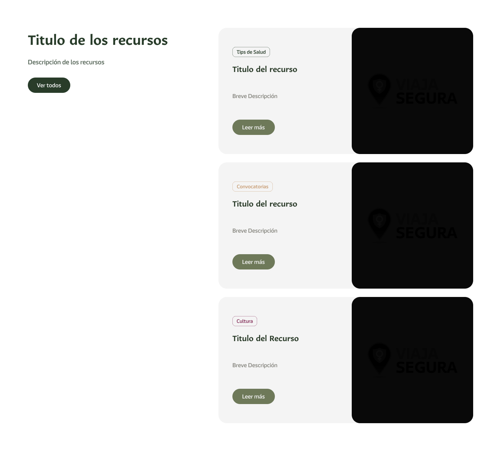

# Componente Recursos para el Ciudadano ###

### Descripción 

Este componente para recursos para el ciudadano es una sección en la página web que muestra la información y servicios más útiles para los ciudadanos.

### Plataformas digitales disponibles:
- Enumere las plataformas digitales relacionadas con su dependencia (por ejemplo, portales de trámites, sistemas de consulta, etc.).
- Incluya una breve descripción de cada plataforma y su finalidad (máximo 2-3 líneas).
- Proporcione el enlace directo a cada plataforma.

### Servicios en línea disponibles:
- Detalle los servicios en línea que se ofrecen a los ciudadanos (por ejemplo, consultas de trámites, pagos en línea, solicitudes de documentos, etc.).
- Especifique los pasos básicos para acceder a cada servicio y cualquier requisito previo necesario.

### Información de soporte:
- Proporcione información de contacto para soporte técnico o asistencia relacionada con las plataformas digitales y servicios en línea (teléfono, correo electrónico, horarios de atención).
- Adjunte un enlace a cualquier guía de usuario o documento de apoyo que facilite el uso de estos servicios.

### Enlaces útiles adicionales (si aplica):
- Incluya cualquier otro enlace relevante para trámites, información (tips, consejos, avisos) o servicios que sea de interés para los ciudadanos.

- **Boton "Ver todos"** Este boton tiene como uso, redirigir a la pagina de "Recursos para el ciudadana" donde se encontrarn los demas recursos.
- **Boton "Leer más"** Este boton tiene como uso, redirigir al link del recurso (encaso de ser necesario) o redirigir a una landingpage acerca del recurso.

### Vista del Componente

