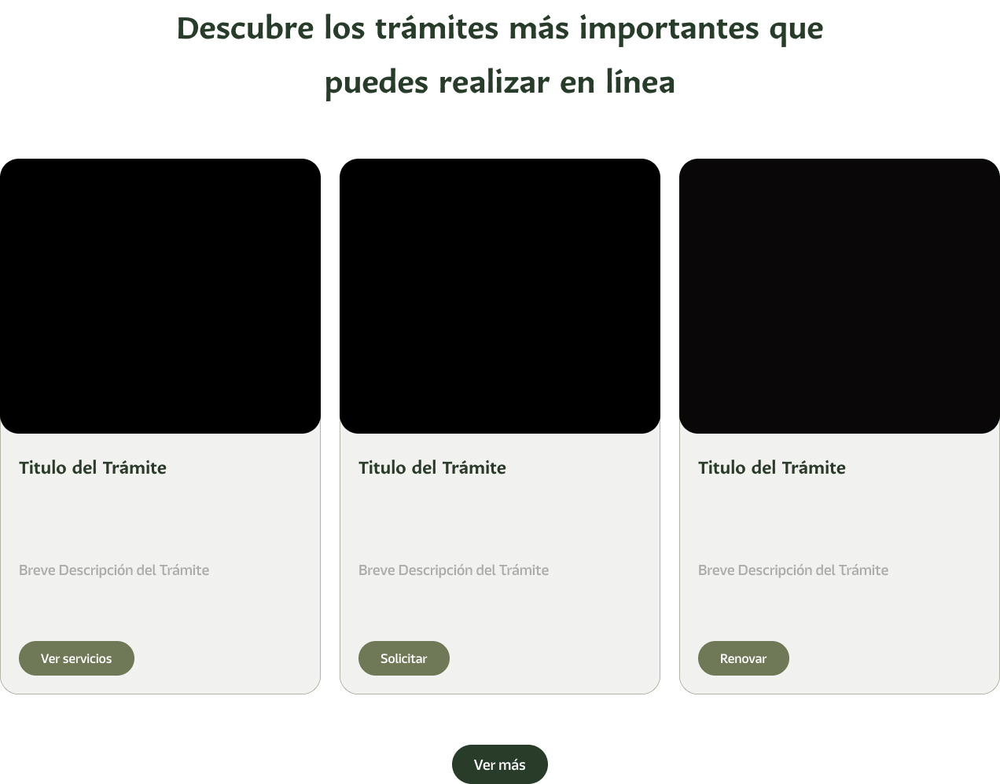

# Componente Trámites

### Descripción 

El componente de trámites es una sección diseñada para guiar a los usuarios en la gestión de procedimientos administrativos o solicitudes.  Aquí podrán consultar los requisitos, procedimientos y costos asociados para realizar trámites.

### Estructura para los Trámites:
### Título del Trámite

Un nombre claro que identifique el trámite de manera específica.

**Ejemplo:** "Acta de Nacimiento"

---

### Breve Introducción

Una descripción corta (2-3 líneas) que explique de forma general el trámite y su propósito.

**Ejemplo:**
> Solicita tu acta de nacimiento de manera sencilla para trámites personales o legales.

---

### Documentos Anexos

Lista de documentos requeridos para realizar el trámite.

**Ejemplo:**
- Identificación oficial (INE, pasaporte, etc.).
- Comprobante de domicilio.

---

### Fechas Importantes

Información sobre plazos, fechas de inscripción o vigencia del trámite, si aplica.

**Ejemplo:**
- Disponible todo el año.
- Horario de atención: Lunes a viernes, 9:00 AM - 3:00 PM.

---

### Costos

Detalla el precio del trámite, si tiene costo, y las formas de pago aceptadas.

**Ejemplo:**
- Costo: $200 MXN.
- Métodos de pago: Efectivo, tarjeta bancaria, transferencia.

---

### Modalidad (Presencial o En Línea)

Especifica si el trámite puede realizarse presencialmente, en línea, o ambas opciones. Incluye URL para trámites en línea, si aplica.

**Ejemplo:**
- Presencial: En las oficinas del Registro Civil.
- En línea: [Realiza tu trámite aquí](#).

---

### Imagen Relacionada al Trámite

Una imagen representativa, como un documento, un ícono o una foto ilustrativa.

---

### Beneficio del Trámite

Resalta el principal beneficio que ofrece el trámite al usuario.

**Ejemplo:**
> Asegura que tu acta de nacimiento esté actualizada para trámites legales.

---

Esta estructura permite mostrar los trámites de forma organizada y accesible, facilitando que el usuario encuentre toda la información que necesita para realizarlos.

- **Boton "Ver Servicio"** Este boton tiene como uso, redirijir a la pagina del Trámite.
- **Boton "Ver Más"** Este boton tiene como uso, redirijir a la pagina de los "Trámites".

### Vista del Componente
