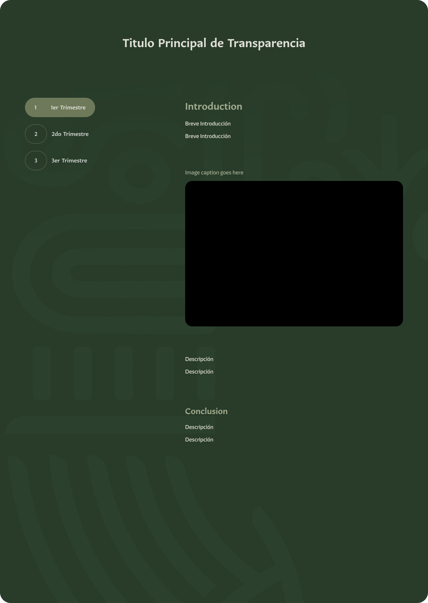

# Componente Transparencia

### Descripción 

Esta vista nos dará pie a dar transparencia a los ciudadanos y un espacio para dar cumplmiento a las peticiones jurídicas de manera clara, accesible y funciona.

### Estructura para la Vista de Transparencia

### Título Principal

**Ejemplo:** "Transparencia y Rendión de Cuentas"

Un encabezado que destaque la importancia de la sección para promover confianza y claridad.

---

### Sección: Cuenta Pública

- **Año de la Cuenta Pública:** Identifica claramente el año al que corresponde la cuenta pública.
- **Breve Descripción:** Una sinopsis que explique qué información contiene la cuenta pública y por qué es importante.

**Ejemplo:**
> La Cuenta Pública de 2023 presenta un desglose detallado de los ingresos, egresos y el uso de los recursos públicos, promoviendo una gestión financiera transparente.

- **Archivo Anexado (PDF):** Enlace directo para descargar el documento.

**Ejemplo:**
> [Descargar Cuenta Pública 2023 (PDF)](#)

---

### Sección: Programas Anuales de Evaluación

- **Año del Programa:** Similar a la cuenta pública, incluye el año correspondiente.
- **Breve Descripción:**

**Ejemplo:**
> El Programa Anual de Evaluación 2024 detalla los objetivos, metodologías y resultados clave de las evaluaciones realizadas en los proyectos institucionales.

- **Archivo Anexado (PDF):**

**Ejemplo:**
> [Descargar Programa Anual de Evaluación 2024 (PDF)](#)

---

### Sección: Convenios

- **Listado de Convenios Activos e Históricos:** Presenta los convenios firmados por la institución.
- **Breve Descripción:**

**Ejemplo:**
> Consulta los convenios de colaboración entre la institución y otras entidades para fomentar el desarrollo y la transparencia.

- **Imagen Relacionada:** Logotipos de las instituciones firmantes o gráficos representativos.
- **Archivo Anexado (PDF):**

**Ejemplo:**
> [Convenio de Colaboración 2024 (PDF)](#)

---

### Consideraciones Técnicas

- **Etiquetas:** Implementa etiquetas claras para cada documento (ejemplo: Año, Tipo de Documento).
- **Buscador:** Integra un buscador para facilitar la localización de documentos específicos.

### Vista del Componente
